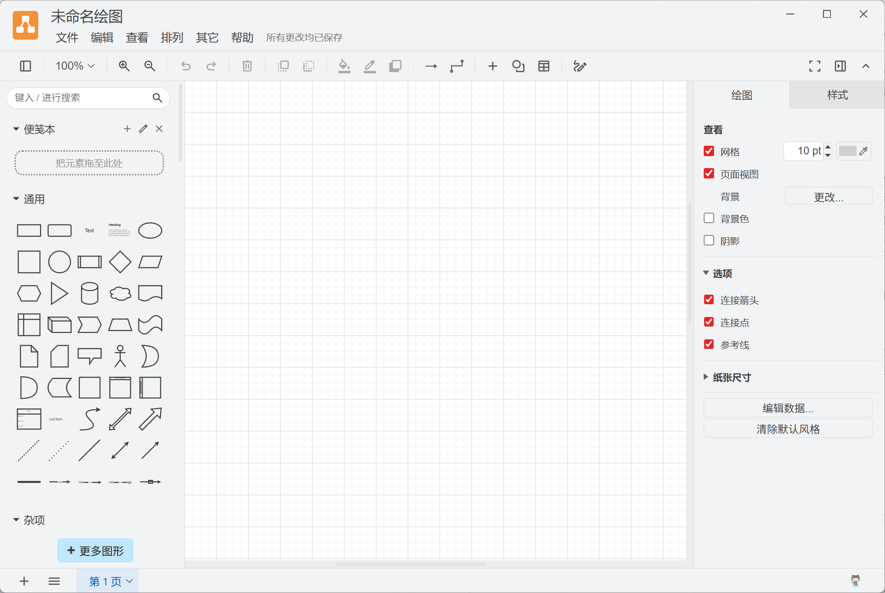

# Drawio Patcher 🎨

> **让你的官方 draw.io 桌面端焕然一新！**  
> 本工具是一个针对 Windows 官方 draw.io 桌面客户端的优化补丁，能为其注入**无边框（Frameless）窗口**、**启动闪屏优化**以及**主题颜色深度自适应**，让你拥有更加纯净、美观、极速的绘图体验。

---

> [!IMPORTANT]
> **版本适配说明**  
> 本补丁基于官方 **draw.io v30.2.6** Windows 桌面版开发并进行完整测试。
> - 其他版本未经测试，若直接覆盖可能存在兼容性问题。
> - 若使用不同版本，推荐使用**方式一**运行脚本尝试自动解析与打包，或在使用前务必做好原始文件备份。

---

## 📸 实现效果

| 1. 极简加载闪屏 (Splash Screen) | 2. 现代化无边框窗口 (Frameless Window) |
| :---: | :---: |
|  |  |
| *平滑过渡的定制加载状态，告别生硬白屏* | *移除传统的窗口标题栏，工作区与菜单栏完美融合* |

### 3. 系统主题深度自适应 (Theme Adaptive)
完美适配 Windows 系统的深浅色模式。当系统切换为深色或浅色主题时，客户端窗口的控制按钮、标题区域及背景将实现自动配色调整，避免出现刺眼的色差，保持视觉一体化。

---

## 🌟 核心特性

- 🖥️ **无边框现代化窗口 (Frameless)**：精简窗口层级，去除多余的系统边框，使应用界面浑然一体。
- 🌗 **主题配色自适应 (Theme Auto-Match)**：智能识别系统的主题色，深色/浅色模式平滑自适应，色彩完美融合。
- ⚡ **闪电般的启动速度 (Instant Launch)**：去除启动时的冗余后台更新检测，提升离线情况下的响应速度，实现秒级开启。
- 🎨 **定制优雅加载页 (Splash Screen)**：优雅的橙色 draw.io Logo 加载动画，带来更佳的视觉过渡。
- 🔒 **纯净无干扰 (Disable Auto-Updates)**：禁用自动更新检测，防止补丁在软件自动更新后被覆盖。

---

## 🚀 使用方法

我们提供了以下两种使用方式，您可以根据需要自由选择：

### 方式一：使用 Node.js 脚本一键注入（推荐 🛠️）
*此方式适合本地有 Node.js 环境的用户，脚本会自动检测路径、备份原始文件并自动完成补丁注入。*

1. 克隆或下载本项目至本地。
2. 在 Windows 搜索栏中输入 `cmd` 或 `PowerShell`，右键选择 **“以管理员身份运行”**（防止系统保护路径无法写入）。
3. 进入本项目的根目录，执行以下命令：
   ```bash
   node drawio-patcher.js
   ```
4. 脚本将自动识别你的 draw.io 安装目录、备份原版 `app.asar` 为 `app.asar.bak`，并一键完成注入。

---

### 方式二：直接替换 `app.asar` 文件（免环境极速版 📦）
*此方式最简单，适合本地未安装 Node.js 的用户。*

1. 在本项目中（或 Releases 页面）直接下载已经打包好的补丁包文件 [app.asar](file:///d:/02%E8%BD%AF%E4%BB%B6/CodeMe/DrawioPatcher/app.asar)（请确认您的 draw.io 客户端版本为 **v30.2.6**）。
2. 找到您的官方 draw.io 桌面端安装目录的 `resources` 文件夹，默认路径通常为：
   * **单用户安装**：`C:\Users\<你的用户名>\AppData\Local\Programs\draw.io\resources\`
   * **全员/系统安装**：`C:\Program Files\draw.io\resources\`
3. **备份原文件**：将该文件夹下的原始 `app.asar` 重命名为 `app.asar.bak`。
4. **覆盖替换**：将下载好的补丁包 `app.asar` 复制进该 `resources` 文件夹中。
5. 重新启动 draw.io 客户端即可！

---

## 🔄 如何还原官方版本

如果您需要恢复为官方默认状态，过程非常简单：

1. 进入官方安装路径的 `resources` 文件夹。
2. 删除带有补丁的 `app.asar` 文件。
3. 将备份的 `app.asar.bak` 恢复重命名为 `app.asar`。
4. 重新启动客户端即可。

---

## 🤝 参与贡献

如果您在使用中遇到任何兼容性问题，或者希望针对新版本进行补丁适配，欢迎提交 Issue 或 Pull Request！
